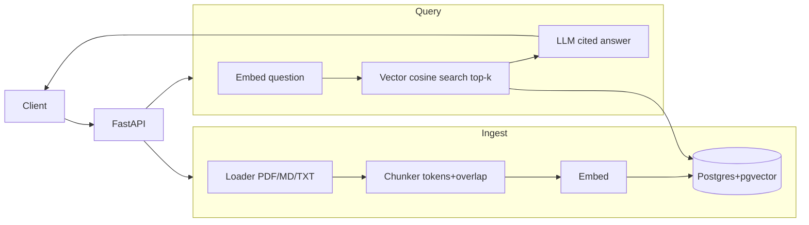

# KB RAG Service

A knowledge-base service backed by **retrieval-augmented generation**. Upload
documents, ask questions, get answers **cited back to source passages**. Built
with FastAPI, Postgres + pgvector, and OpenAI — and shipped with an **eval
harness** that reports recall@5 and faithfulness so changes are measurable.

> Resume-anchor project. The point is engineering judgment, not a demo: a real
> vector store, citations as a first-class output, and numbers in the README.

<!-- badges -->

[](https://www.python.org)

## Live demo

<!-- TODO: pin deployed URL + demo GIF here. CI must be green before claiming it. -->

## How it works



- **Ingest** (`POST /documents`): parse → token-based chunking (512 tok, 64
  overlap) → embed (`text-embedding-3-small`) → store in pgvector with
  `(document_id, chunk_idx, source, content)`.
- **Query** (`POST /query`): embed the question → cosine search top-k over an
  HNSW index → feed numbered passages to `gpt-4o-mini` instructed to cite by
  passage number → map `[n]` markers back to concrete chunks → return
  `{answer, retrieved[], citations[]}`.

## Quickstart

Requirements: Docker, `uv` (`curl -LsSf https://astral.sh/uv/install.sh | sh`).

```bash
git clone <repo> && cd kb-rag-service
cp .env.example .env       # fill in OPENAI_API_KEY
docker compose up -d        # Postgres + pgvector
uv sync --extra dev
uv run alembic upgrade head

uv run uvicorn app.main:app --reload
# health
curl localhost:8000/health
# ingest the bundled sample corpus
for f in sample_corpus/*.md; do curl -s -F "file=@$f" localhost:8000/documents; done
# ask
curl -s -XPOST localhost:8000/query -H 'Content-Type: application/json' \
  -d '{"question":"What are the three stages of RAG?"}' | jq
```

## API

| Method | Path | Body | Returns |
|---|---|---|---|
| `POST` | `/documents` | multipart `file` | `{document: {id, source, title, num_chunks}}` |
| `GET` | `/documents` | — | `[{id, source, title, num_chunks}, ...]` |
| `DELETE` | `/documents/{id}` | — | 204 |
| `POST` | `/query` | `{question, top_k?}` | `{question, answer, retrieved[], citations[]}` |
| `GET` | `/health` | — | `{status: "ok"}` |

`citations[]` = the chunks the model chose to cite (with source + snippet);
`retrieved[]` = the full top-k actually retrieved (with cosine distance) — useful
for debugging retrieval and for the eval harness.

## Evaluation

```bash
uv run python evals/run_evals.py --k 5
```

Reports **recall@5** (retrieval) and **faithfulness** (LLM-judged generation)
over 15 hand-labeled Q&A pairs in `evals/dataset.jsonl`, and writes
`evals/results.json`.

| Metric | Score |
|---|---|
| recall@5 | _<fill after first run>_ |
| faithfulness | _<fill after first run>_ |

See `evals/README.md`.

## Design decisions

- **pgvector over a dedicated vector DB** — one service to run, keeps document
  metadata and embeddings in the same transactional store, and shows SQL+vector
  skills. Cosine distance via the `<=>` operator on an HNSW index (`vector_cosine_ops`).
  HNSW over ivfflat: better recall at similar latency, no training step. Tradeoff:
  HNSW uses more memory; for very large corpora ivfflat can win once tuned.
- **Token-based chunking with overlap (512/64)** — defensible default for prose;
  overlap prevents context loss at boundaries. The chunker is a pure function in
  its own module, so it's unit-tested without a DB and swappable for
  sentence/semantic chunking.
- **OpenAI behind a thin client** — all embedding/chat calls are funneled through
  `app/retrieval/embed.py` and `app/generation/answer.py` plus `app/config.py`.
  Swapping providers means editing those, not the whole codebase.
- **Citations are first-class** — chunks keep `(document_id, chunk_idx, source)`;
  the prompt forces `[n]` citation and the router resolves markers to concrete
  chunks with snippets. This is what separates a KB tool from "ChatGPT + a PDF."
- **Evals as a core feature** — a held-out labeled set and two independent
  metrics (retrieval vs. generation) tracked as numbers, not vibes.

## Project layout

```
app/            config, db, models, schemas, main
  ingest/       loader, chunker, pipeline
  retrieval/    embed, search
  generation/   answer
  routers/      documents, query
alembic/        migrations (CREATE EXTENSION vector + HNSW index)
evals/          dataset.jsonl, run_evals.py, README
sample_corpus/  5 markdown docs so the demo + evals work out of the box
tests/          chunker (unit), api (smoke), search (integration)
```

## License

MIT
